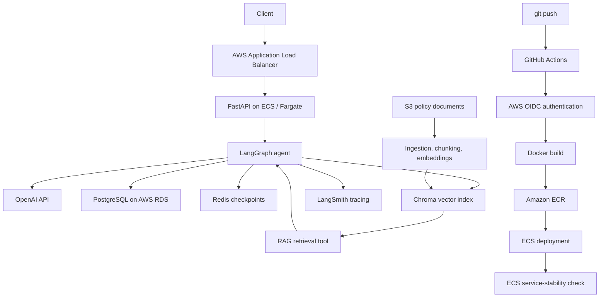

# AI Customer Support Agent

## Overview

An agentic e-commerce customer-support system built with LangGraph orchestration, retrieval-augmented generation (RAG) over support policies, and structured tools for order lookup and controlled actions. Deterministic Python rules—not the language model—authorize business operations and database mutations. Redis-backed checkpoints provide persistent multi-turn state, LangGraph interrupt/resume provides true administrator-in-the-loop approval, and the FastAPI service is packaged for production-style deployment on AWS ECS/Fargate.

## Architecture



## Agent Decision Model

The LLM understands natural-language requests and selects the appropriate tool. Deterministic Python owns business rules, validates order state, controls database mutations, and decides whether an action is allowed; these controls cannot be overridden by the LLM.

## Cancellation + HITL Flow

- `created`, `approved`, or `processing` → automatic cancellation.
- `invoiced` with no prior denial → admin-review workflow. Logically this is a `PENDING_REVIEW` request followed by `interrupt()`, a persisted Redis checkpoint, authenticated admin approval or denial, and `Command(resume=...)` resuming the same workflow. To keep PostgreSQL and checkpoint state consistent, the ticket is committed only after the paused checkpoint is established.
- Admin approval → the resumed deterministic workflow revalidates eligibility and executes the cancellation.
- Admin denial → denial is terminal while the order remains `invoiced`; later attempts are deterministically rejected without a new ticket or interrupt.
- `shipped`, `delivered`, `canceled`, `cancelled`, `unavailable`, or unknown status → deterministic hard rejection.

Admin approval and denial endpoints require the `X-Admin-Key` header.

## Reliability / State Consistency

PostgreSQL review records and LangGraph/Redis checkpoints must represent the same workflow state. Review creation is retry-safe: a failed checkpoint transition cannot leave an orphan `PENDING_REVIEW` ticket, and legitimate duplicate pending reviews are prevented.

## Evaluation

- 20/20 tool-routing cases passed.
- 8/8 RAG source-hit cases passed.
- 20 cancellation/HITL regression tests passed.
- 99,441 Olist orders loaded into PostgreSQL.

## Tech Stack

- **AI / Agent:** LangGraph, LangChain, OpenAI
- **Retrieval:** Chroma, embeddings, AWS S3
- **Data:** PostgreSQL, AWS RDS, Redis
- **Backend:** FastAPI, Uvicorn, SQLAlchemy
- **Cloud:** AWS ECS/Fargate, ECR, ALB, Secrets Manager, CloudWatch
- **Observability:** LangSmith
- **CI/CD:** GitHub Actions, AWS OIDC, Docker

## API

- `GET /health` — service health check.
- `POST /chat` — accepts `message` and client-supplied `thread_id`; returns an assistant response or a structured approval-required interrupt.
- `POST /admin/reviews/{ticket_id}/approve` — resumes and approves a pending cancellation review; requires `X-Admin-Key`.
- `POST /admin/reviews/{ticket_id}/deny` — resumes and denies a pending cancellation review; requires `X-Admin-Key`.
- `/docs` — interactive Swagger/OpenAPI documentation.

## Design Tradeoffs / Limitations

- A shared admin API key is used instead of enterprise SSO or role-based access control.
- The image packages a Chroma snapshot instead of using a managed vector database.
- There is no dedicated admin frontend.
- The evaluation suite is intentionally small and targeted.
- Database tables use a simple initialization approach rather than Alembic migrations.

## Repository Structure

```text
src/
├── agent/          # LangGraph state, model, tools, and checkpoint wiring
├── api/            # FastAPI application and admin review endpoints
├── db/             # SQLAlchemy tables and database operations
├── evaluation/     # Local evaluation runner
├── rag/            # S3 document ingestion and Chroma retrieval
└── tools/          # Order, policy, ticket, and cancellation tools
scripts/            # Database setup, Olist loading, and index building
data/evaluation/    # JSONL evaluation cases
data/support_docs/  # Example policy source documents
tests/              # Cancellation and HITL regression tests
main.py             # Interactive CLI
Dockerfile          # FastAPI application image
.github/workflows/  # GitHub Actions deployment workflow
```

## Local Development

Python 3.11, PostgreSQL, and Redis are required. Policy ingestion also requires access to an S3 bucket containing Markdown documents.

```bash
python -m venv .venv
source .venv/bin/activate
pip install -r requirements.txt
cp .env.example .env
```

Configure `.env` with environment-specific values; keep credentials out of version control:

```dotenv
OPENAI_API_KEY=<openai-api-key>
LANGSMITH_API_KEY=<langsmith-api-key>
AWS_REGION=<aws-region>
S3_BUCKET_NAME=<s3-bucket-name>
AWS_ACCESS_KEY_ID=<aws-access-key-id>
AWS_SECRET_ACCESS_KEY=<aws-secret-access-key>
DATABASE_URL=postgresql+psycopg://<user>:<password>@<host>:5432/<database>
REDIS_URL=redis://<host>:6379/0
ADMIN_API_KEY=<admin-api-key>
```

```bash
python -m scripts.init_database
python -m scripts.load_orders
python -m scripts.build_support_index
python -m uvicorn src.api.app:app --host 0.0.0.0 --port 8000
```

Run the CLI with `python main.py`, the tests with `pytest`, and the evaluator with `python -m src.evaluation.evaluator`.
